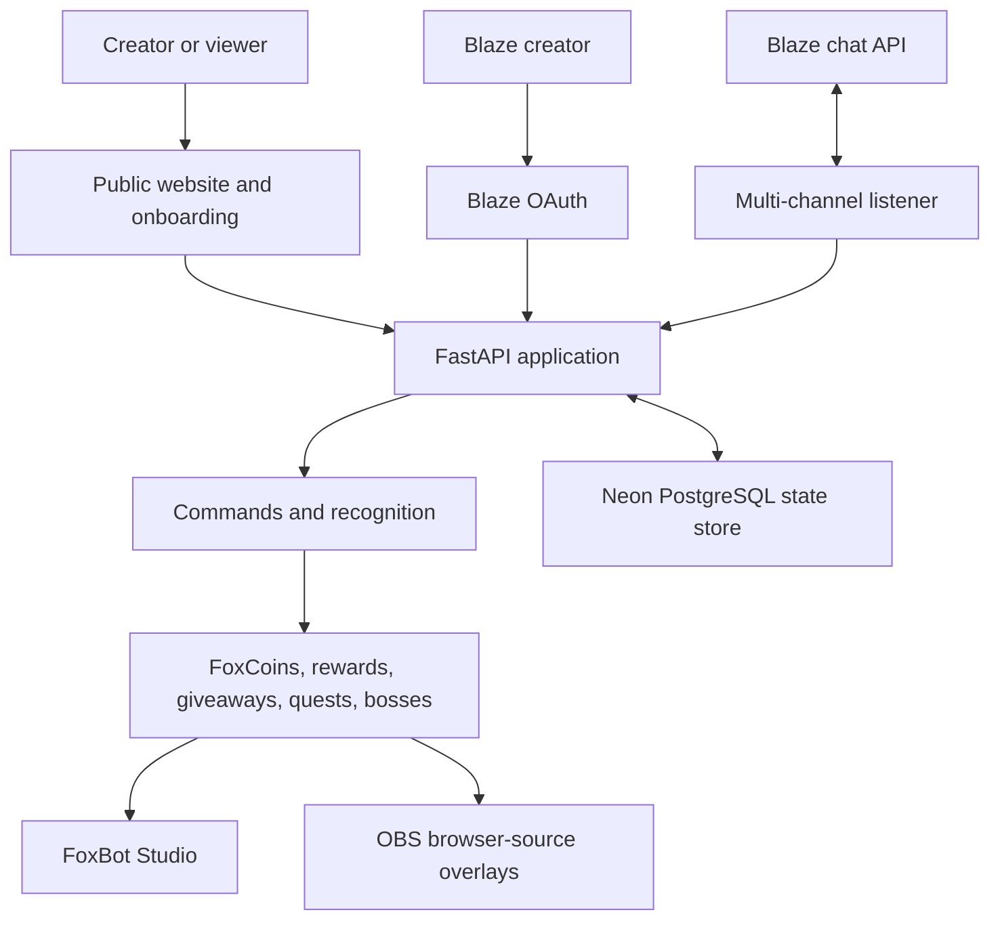
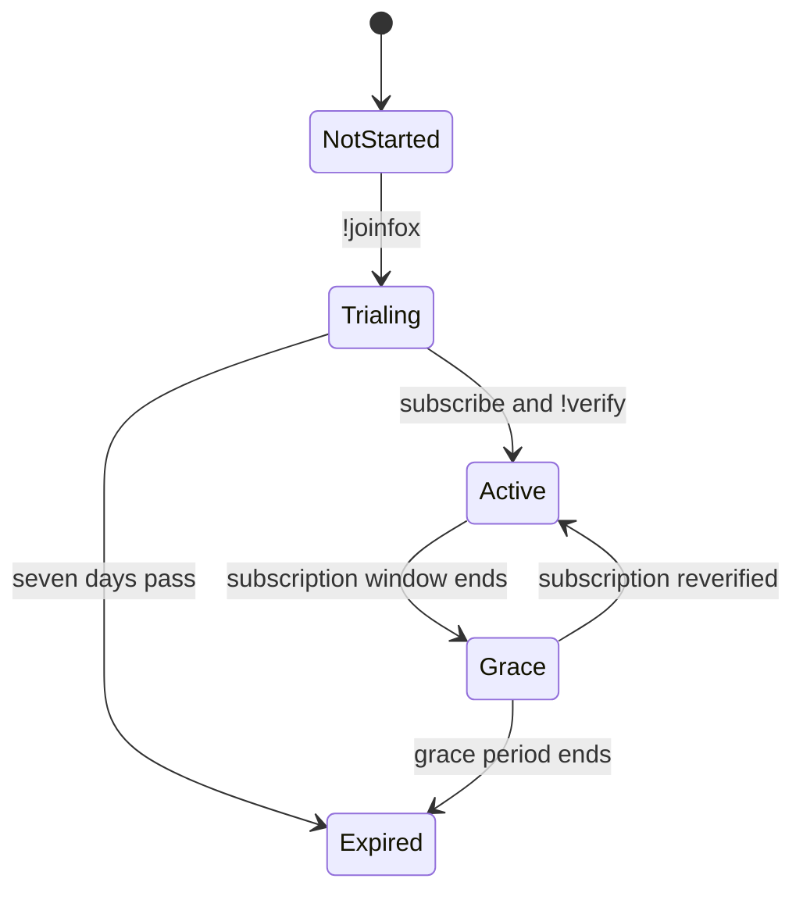

# FoxBot AI Architecture

FoxBot AI is a FastAPI application that combines a public product website, creator onboarding, a creator dashboard, Blaze OAuth and chat polling, engagement systems, OBS overlays, and durable creator access state.

## System overview

## Runtime components

| Component | Responsibility |
|---|---|
| FastAPI application | Routes, APIs, command dispatch, dashboards, overlays, and integration orchestration |
| Public website | Product explanation, pricing, onboarding, commands, FAQ, and calls to action |
| FoxBot Studio | Creator control surface for recognition, economy, rewards, events, analytics, and diagnostics |
| Blaze OAuth | Creator authorization and refreshable access tokens |
| Multi-channel listener | Polls the owner channel, FoxBot subscription-control channel, and active creator channels |
| Creator access service | Seven-day trials, subscription verification, grace state, and creator channel metadata |
| Neon PostgreSQL | Durable JSON state documents for creator access and OAuth tokens |
| Local JSON fallback | Local development compatibility when `DATABASE_URL` is not configured |
| OBS overlays | Giveaway, redemption, and boss-battle browser sources |

## Creator access flow

The FoxBot owner channel always remains available. External creator channels are included in the listener target list only while their trial or subscription access is active.

## Persistence flow

1. FoxBot reads `DATABASE_URL` at runtime.
2. `services/postgres_state.py` creates the `foxbot_state` table when needed.
3. Existing local creator or OAuth JSON is migrated into PostgreSQL once.
4. State changes are written atomically with a PostgreSQL upsert.
5. Compatibility JSON files are restored on startup so existing FoxBot integrations continue working.
6. If no database is configured, local development continues with JSON files.

The database connection string and OAuth credentials are environment secrets and are never committed.

## Deployment model

The public deployment runs as a Render web service. The current free instance can sleep after inactivity, which stops background polling until the service wakes. Durable state remains safe in Neon. Continuous listener availability requires always-on compute.

## Key health endpoints

| Endpoint | Purpose |
|---|---|
| `/api/foxbot/storage/status` | PostgreSQL configuration and connectivity |
| `/api/foxbot/token-source` | Active OAuth token source without exposing the token |
| `/api/foxbot/multichannel/targets` | Resolved owner, subscription, and creator channels |
| `/api/foxbot/multichannel/status` | Listener runtime health |
| `/api/blaze/oauth/status` | OAuth configuration status with masked token information |
| `/api/foxbot/subscription/config` | Public trial, price, profile, and command configuration |
