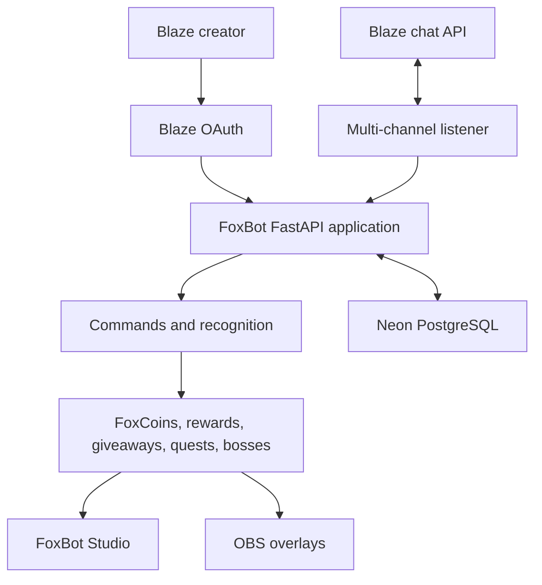

# FoxBot AI

**The Creator Command Center for Blaze**

FoxBot AI is a Blaze-connected creator platform for stream automation, viewer recognition, community rewards, interactive events, OBS overlays, analytics, and live bot control.

It combines a polished public website, guided creator onboarding, Blaze OAuth, a multi-channel chat listener, a unified Studio dashboard, and durable creator access state in one FastAPI application.

## Live application

| Experience | Link |
|---|---|
| Public website | <https://foxbot-ai-chatbot.onrender.com> |
| Creator onboarding | <https://foxbot-ai-chatbot.onrender.com/get-started> |
| FoxBot Studio | <https://foxbot-ai-chatbot.onrender.com/admin> |
| Live chat demo | <https://foxbot-ai-chatbot.onrender.com/demo-chat> |
| Judge demo | <https://foxbot-ai-chatbot.onrender.com/demo> |
| Connected creators | <https://foxbot-ai-chatbot.onrender.com/connected-creators> |
| Project status | <https://foxbot-ai-chatbot.onrender.com/project-status> |
| Smoke test | <https://foxbot-ai-chatbot.onrender.com/smoke-test> |
| Live proof | <https://foxbot-ai-chatbot.onrender.com/proof> |

## Product highlights

- Real Blaze OAuth login and refreshable token storage
- Owner, subscription-control, and active creator channel targets
- Seven-day creator trial through `!joinfox`
- Blaze subscription verification through `!verify`
- Viewer recognition for follows, votes, subscriptions, gifts, and tips
- FoxCoins balances, daily claims, leaderboards, rewards, and redemptions
- Giveaways, boss battles, community quests, streaks, and stream events
- OBS browser-source overlays
- Creator analytics, diagnostics, and live control
- Durable OAuth and creator access state in Neon PostgreSQL
- Local JSON fallback for development

FoxBot's public website does not display invented creator, revenue, uptime, viewer, or command statistics. Operational status comes from real backend endpoints.

## Creator access

FoxBot uses a straightforward Blaze-native access model:

1. Type `!joinfox` in the FoxBot Blaze profile chat.
2. Receive full creator access for seven days.
3. Type `!access` to check the current access state.
4. Subscribe at <https://blaze.stream/foxbotai> for continued access at $5 per month.
5. Type `!verify` in the FoxBot profile chat after subscribing.

The FoxBot owner channel remains available without a subscription.

## Architecture



See [ARCHITECTURE.md](ARCHITECTURE.md) for the complete system and persistence flows.

## Main systems

### Blaze integration

- OAuth login and callback
- Persisted access and refresh tokens
- Token-priority handling that favors fresh saved OAuth state
- Multi-channel polling
- Live command replies
- Subscription role verification

### Recognition and engagement

- Follow, vote, subscription, gift, and tip recognition
- MVP and OG recognition
- FoxCoins economy and leaderboards
- Reward shop and redemptions
- Giveaways and winner selection
- Boss battles, quests, streaks, events, and arcade games

### Creator tools

- Unified FoxBot Studio dashboard
- Guided onboarding
- Connected Creator profiles
- Bot and listener controls
- Analytics and diagnostics
- OBS overlay management

## OBS overlays

| Overlay | URL |
|---|---|
| Giveaway | <https://foxbot-ai-chatbot.onrender.com/overlay/giveaway> |
| Redemptions | <https://foxbot-ai-chatbot.onrender.com/overlay/redemptions> |
| Boss Battle | <https://foxbot-ai-chatbot.onrender.com/overlay/boss> |

Recommended OBS browser-source size: **1920 by 1080**.

## Technology

- Python
- FastAPI and Uvicorn
- HTML, CSS, and JavaScript
- Blaze OAuth and chat APIs
- Neon PostgreSQL
- Render deployment
- OBS browser sources

## Local setup

```powershell
git clone https://github.com/Crypt0kingfx/foxbot-ai-chatbot.git
Set-Location .\foxbot-ai-chatbot
python -m venv .venv
.\.venv\Scripts\python.exe -m pip install -r requirements.txt
Copy-Item .\.env.example .\.env
.\.venv\Scripts\python.exe -m uvicorn app:app --host 127.0.0.1 --port 8000
```

Fill `.env` with your own Blaze credentials. For durable production state, add a pooled Neon PostgreSQL URI as `DATABASE_URL`.

See [INSTALLATION.md](INSTALLATION.md) for complete configuration, verification, OAuth, persistence, and deployment instructions.

## Core commands

### Creator access

```text
!joinfox
!access
!verify
!profile
!rank
```

### Viewer and economy

```text
!help
!schedule
!faq
!socials
!stats
!leaderboard
!daily
!balance
!shop
!redeem
```

### Interactive systems

```text
!giveaway
!enter
!boss
!bossstatus
!attack
!powerattack
!arcade
!coinflip
!roll
!8ball
!rps
!foxhunt
```

Administrative commands are limited to the appropriate creator/admin workflow and should be demonstrated only with test data.

## Persistence

`services/postgres_state.py` stores creator access and OAuth documents in Neon PostgreSQL using atomic upserts. Existing JSON files are migrated automatically and remain as a compatibility layer. When `DATABASE_URL` is absent, local development falls back to JSON files.

Production persistence was verified across a Render redeploy:

- Neon connected: true
- OAuth state restored: true
- Token available: true
- Token source: `saved_oauth_file`

## Final validation

The final diagnostic completed on 2026-07-17 with:

- **44 passed**
- **1 warning**
- **0 failed**

The warning records the expected Render Free limitation: background polling stops when the free service sleeps. No listener error or data-integrity failure was present.

See [FINAL_TEST_REPORT.md](FINAL_TEST_REPORT.md) for route and system coverage.

## Documentation

- [Architecture](ARCHITECTURE.md)
- [Installation](INSTALLATION.md)
- [Judge walkthrough](JUDGE_WALKTHROUGH.md)
- [Final test report](FINAL_TEST_REPORT.md)
- [Security notes](SECURITY.md)
- [Submission summary](SUBMISSION.md)

## Known hosting limitation

The demonstration deployment uses Render Free. Render can sleep after inactivity, so the background listener might need to be started after the service wakes. OAuth tokens, creator trials, and subscription state remain durable in Neon PostgreSQL.

## Project goal

FoxBot is designed to feel like a commercial creator platform rather than a collection of disconnected chatbot features. It gives Blaze creators one consistent command center for automation, engagement, overlays, rewards, and operational visibility.
