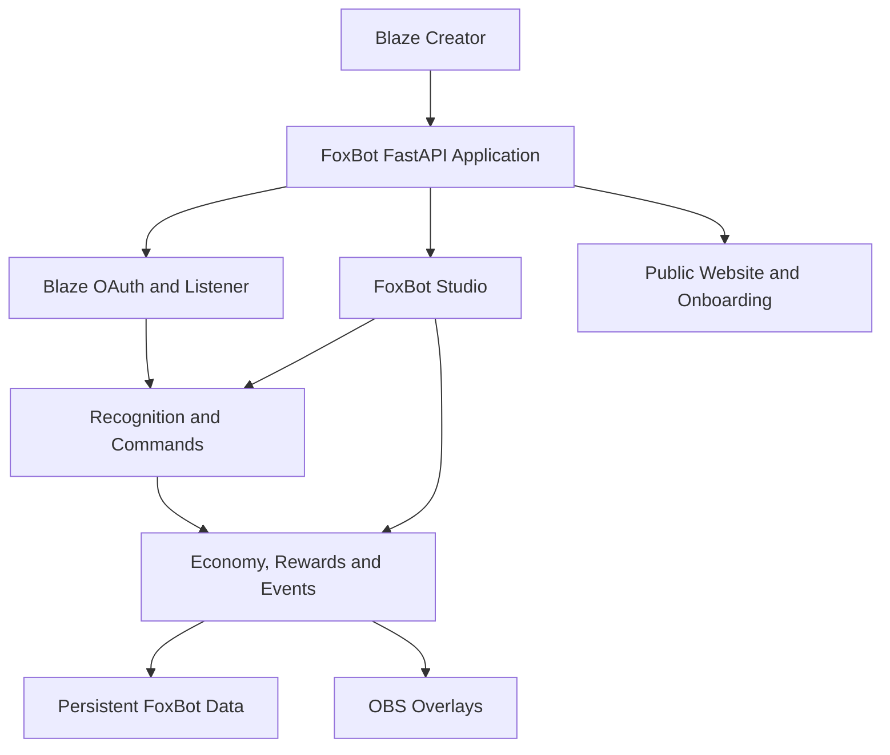

# FoxBot AI

**The Creator Command Center for Blaze**

FoxBot AI is a Blaze-connected creator platform for stream automation, viewer recognition, community rewards, interactive events, OBS overlays, analytics, and live bot control.

FoxBot combines a public SaaS-style website, guided creator onboarding, a unified Studio dashboard, and a real Blaze integration in one FastAPI application.

## Live Application

| Experience | Link |
|---|---|
| Public website | https://foxbot-ai-chatbot.onrender.com |
| Creator onboarding | https://foxbot-ai-chatbot.onrender.com/get-started |
| FoxBot Studio | https://foxbot-ai-chatbot.onrender.com/admin |
| Live chat demo | https://foxbot-ai-chatbot.onrender.com/demo-chat |
| Connected creators | https://foxbot-ai-chatbot.onrender.com/connected-creators |
| Project status | https://foxbot-ai-chatbot.onrender.com/project-status |
| Judge demo | https://foxbot-ai-chatbot.onrender.com/demo |
| Smoke test | https://foxbot-ai-chatbot.onrender.com/smoke-test |
| Live proof | https://foxbot-ai-chatbot.onrender.com/proof |

## Product Overview

FoxBot gives Blaze creators one place to:

- Connect their Blaze account through OAuth
- Monitor the Blaze listener and bot status
- Recognize follows, votes, subscriptions, tips, and community activity
- Reward viewers through the FoxCoins economy
- Manage rewards and redemptions
- Run giveaways and select winners
- Launch boss battles, quests, streaks, and stream events
- Configure OBS browser-source overlays
- Review real activity and engagement analytics
- Generate stream ideas through the Fox AI assistant
- Diagnose routes, tokens, listener state, and saved data

No artificial platform statistics are displayed on the public website. Status information is loaded from FoxBot's real backend endpoints.

## Architecture



## Main Systems

### Blaze Integration

- Blaze OAuth login and callback
- Access-token and refresh-token status
- Native listener and polling support
- Listener status and control endpoints
- Live chat parsing
- Event bridge
- Configurable automatic sending

### Recognition Center

- Follow, vote, subscription, gift, and tip recognition
- MVP and OG recognition
- Recognition queue and history
- Configurable recognition rewards

### FoxCoins Economy and Rewards

- Viewer balances and daily claims
- Leaderboards and administrative balance controls
- Transaction tracking
- Reward shop and viewer redemptions
- Custom, premium, and elite rewards
- OBS redemption support

### Interactive Stream Systems

- Giveaways
- Boss battles
- Community quests
- Stream events
- Viewer streaks
- FoxBot Arcade
- Custom chat commands

### Creator Tools

- FoxBot Studio dashboard
- Guided onboarding
- Connected Creator profiles
- Bot Control
- Analytics
- Fox AI assistant
- Diagnostics Center
- Project status
- Judge demonstration tools

### OBS Overlays

- Giveaway overlay
- Redemptions overlay
- Boss battle overlay
- Event and streak previews
- Browser-source URLs managed through Studio

Recommended OBS browser-source resolution:

```text
Width: 1920
Height: 1080
```

## Technology

- Python
- FastAPI
- Uvicorn
- HTML, CSS, and JavaScript
- Blaze OAuth
- Render
- JSON-based persistence
- OBS browser sources

## Local Setup

### 1. Clone the repository

```powershell
git clone https://github.com/Crypt0kingfx/foxbot-ai-chatbot.git
cd foxbot-ai-chatbot
```

### 2. Create a virtual environment

```powershell
python -m venv .venv
```

### 3. Install dependencies

```powershell
.\.venv\Scripts\python.exe -m pip install -r requirements.txt
```

### 4. Configure environment variables

Blaze configuration:

```text
BLAZE_CLIENT_ID
BLAZE_CLIENT_SECRET
BLAZE_REDIRECT_URI
BLAZE_ACCESS_TOKEN
BLAZE_REFRESH_TOKEN
BLAZE_CHANNEL_ID
BLAZE_CHANNEL_SLUG
BLAZE_BOT_USER_ID
```

FoxBot runtime configuration:

```text
FOXBOT_BLAZE_AUTO_SEND
FOXBOT_BLAZE_PROFILE_HANDLE
FOXBOT_BLAZE_USER_ID
FOXBOT_DATA_FILE
FOXBOT_FAQ
FOXBOT_MODE
```

The OAuth redirect URI must exactly match the URI registered with Blaze.

Production callback:

```text
https://foxbot-ai-chatbot.onrender.com/auth/blaze/callback
```

Keep client secrets, access tokens, and refresh tokens out of Git.

### 5. Verify the application

```powershell
.\.venv\Scripts\python.exe -m py_compile .\app.py
```

### 6. Start FoxBot locally

```powershell
.\.venv\Scripts\python.exe -m uvicorn app:app --host 127.0.0.1 --port 8000
```

Open `http://127.0.0.1:8000`.

## Command Reference

### Core Viewer Commands

```text
!help
!schedule
!faq
!socials
!stats
!leaderboard
!hugs
!profile
!rank
!connect
```

### FoxCoins Commands

```text
!daily
!balance
!points
!foxcoins
!coinleaderboard
!shop
!redeem
```

Administrative economy commands:

```text
!givepoints username amount
!takepoints username amount
!addreward name cost message
!delreward name
```

### Giveaway Commands

```text
!giveaway
!enter
!entries
!pickwinner
```

Giveaway creation and winner selection are administrative actions.

### Boss Battle Commands

```text
!boss
!bossstatus
!startboss Cyber Fox Dragon
!attack
!powerattack
!bossleaderboard
!endboss
```

### FoxBot Arcade Commands

```text
!arcade
!coinflip
!roll
!8ball
!rps
!foxhunt
```

### Custom Commands

```text
!commands
!addcmd
!delcmd
```

## Testing Checklist

Before deploying or submitting FoxBot, compile the application:

```powershell
.\.venv\Scripts\python.exe -m py_compile .\app.py
```

Verify:

- Public homepage loads
- Creator onboarding loads real status
- Blaze OAuth route begins authorization
- Studio navigation switches between every module
- Listener status loads
- Connected Creators API responds
- Demo chat remains available
- Giveaways and rewards load saved data
- Overlay routes render correctly
- Analytics loads real backend data
- Diagnostics and smoke-test routes respond
- Desktop and mobile layouts remain usable

## Submission Walkthrough

1. Open the public homepage.
2. Review FoxBot's creator features.
3. Open Creator Onboarding.
4. Review real OAuth, creator, and listener readiness.
5. Enter FoxBot Studio.
6. Open Bot Control and Recognition.
7. Review Economy and Rewards.
8. Open Giveaways, Boss Battles, Quests, and Stream Events.
9. Preview OBS overlays.
10. Review Analytics and Diagnostics.
11. Open the live chat demo or Judge Demo for command testing.

## Data and Persistence

FoxBot stores application state in JSON-backed data files. Production deployments that require durable local files should use persistent storage or an external data store.

Token files and environment secrets must never be committed to the repository.

## Deployment

FoxBot is deployed on Render and starts as a FastAPI/Uvicorn web service. After merging changes into `main`, verify the live deployment and complete the testing checklist above.

## Project Direction

FoxBot's goal is to provide Blaze creators with a professional, unified creator platform—not only a chat bot. The product combines automation, community engagement, live stream controls, overlays, and operational visibility in one system.
